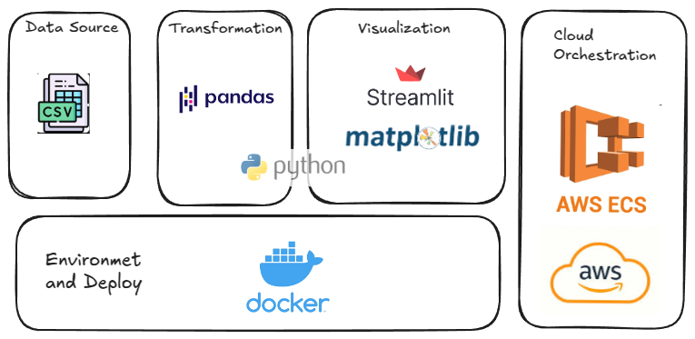

# 📊 Customer Churn Dashboard
An interactive data dashboard built with **Streamlit** to visualize 
customer churn data from a CSV file. The app runs inside a **Docker container** 
and is ready for deployment on **AWS** (e.g., EC2 or ECS).




## Features

- Loads customer data from a CSV file
- Displays churn distribution and monthly charges
- Interactive dashboard using Streamlit
- Dockerized for easy deployment
- Compatible with cloud environments like AWS

## Requirements

- Python 3.12
- Docker
- Streamlit
- pandas
- matplotlib

## Running 

1. **Build the Docker image:**

```bash
docker build -t docker_image_streamlit .
```

2. **Build the Docker image:**
```bash
docker run -d -p 8501:8501 docker_image_stream docker_image_stream
```

## Author
*Itaira S. F. Santos*